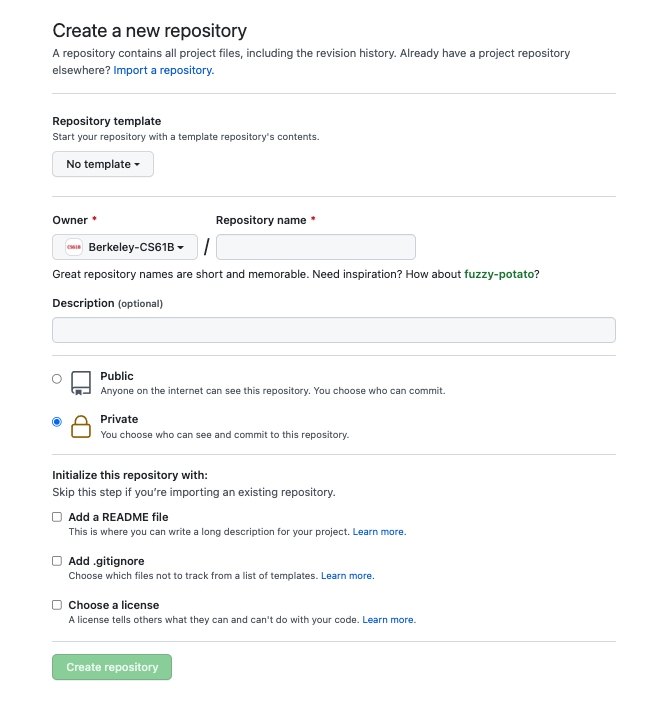
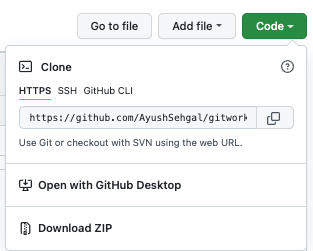

## Level 1: Help Please!

## Instructions
Welcome to Level 1! Here we are going to take a deep dive into some super cool and crutial git commands and annoyingly put our answers in individual files. We will also be getting our hands dirty with some git stuff. You may not need all of these commands for this class per say, but you will be using most of these in your daily life out in the wild and a lot of them will help your workflow in this class as well. Make sure to put any files you create in the `src` folder provided for you. You will be creating a lot of files in this part. We suggest you use `vim [filename]` or `nano [filename]` to do this. Have fun!

1. Type `git add`
   - If you want to stage all modified files what do you put after add? Put the entire command `git add [symbol]` in a file called `stage.txt`
   - If you don't put the symbol above, you can simply list out all the files you want to stage for commit. But what exactly does staging mean? That means you are preparing for it to be sent, you aren't actually sending it anywhere, you are just preparing it, marking the file stating that you are done modifying it. To actually wrap up all the files you have staged, you must then do `git commit -m [message]`, and finally `git push` to get it onto your remote repository (github). Now that you understand the three basic commands, lets dive deeper into other commands you will encounter and a little more detail on the above ones. 
2. Type `git help`
   - a. Take note of the first command on the help page displayed from step1, create a file titled `first.txt` and put the name of the command in this file.
   - b. Take note of the last command on the help page displayed from step1, create a file titled `last.txt` and put the name of the command in this file.
3. Type `git log`.
   - a. Fill in the blank "Git Log is the command that will display all **\_\_\_\_** that have been pushed to github." Put your answer in a file titled `log.txt`, make sure the only thing in that file is one word, your answer to the blank above.
4. Type `git help log`
   - a. What is the name of the formatting argument that will allow you to format the output of the git log command. Hint: look under `Commit Formatting`
     - Put your answer in a file titled `log_format.txt`, do not include the `--` just put the name of the command on the first line. 
   - b. On a new line, put the full command needed to display each element in the log in oneline. 
   - Hence, your final `log_format.txt` file should look like:
   ***
   `[answer to a]`  
   `[git log --[answer to a][command specifying one line]]`   
   ***
5. Type `git remote`
   - This outputs the name of the repository on github that your local repo is connected to. While helpful, we really want the url address of that repo that your local folder is connected to when you cloned the repo. Use the `git help remote` menu to figure out how to get git to display both the name and the link associated with that name. 
   - Put the full command in a file called `remote.txt`
6. Type `git branch`
   - Branches are super useful. They help create parallel tracks of a project and allow many people to work on different parts of the project or work on things together. For instance, you can have a separate branch for each new feature you are trying to add to your project which you can then merge later when you have fully implemented and tested that new feature. You can also divide the work in your project team by assigning a different branch to each person in your team. 
   - This command should display all the branches you have visited, but does not display all the branches you have access to. For instance, there is a level2 branch which you will not see locally until you actually move to that branch. To see all the branches available, you would have to see that information on github.
   - a. What command takes you from branch to branch? Put your answer in a file called `branch.txt`. Format your answer like this `git [command] new_branch`. 
   - b. There are two ways to create branches one using the `git branch` command and one using the command you found in part a. Lets focus first on `git branch`. Perform a google search or read the documentation to figure out how to use `git branch` to create a new branch. Once you figure that out, put the full command you need to create a branch called `hello_world` in a file called `branch_create.txt`. 
   - c. Now, lets do the same thing but with the command you found in part a. Type `git help [command from a]` and try to find the argument you need to create a new branch. Put the full command as a second line in `branch_create.txt` right under your answer to b, the new branch you are creating should also be titled `hello_world`. 
   - Think about what the difference between these two commands are. Do some google searches if you need to. 
7. Type `git push`
   - Now, this command actually pushes everything from your local repo to github. The push command needs two arguments, figure out what those arguments are. 
   - A sample command using push is `git push origin main`. Based on what you have seen so far, without any searches. What is origin? It is the name of the ______ repository. 
   - a. In a file titled `push.txt` on one line put the answer to the blank above. 
   - b. In the same file, on the next line put the answer to the following blank. What is main? It is the name of the ______. 
8. Type `git status`
   - This shows all the modified files and those that you have staged (result of calling git add on those files stages them). 
   - You should see all the files listed below on this `git status` menu. 

## Deliverables
- stage.txt
- first.txt
- last.txt 
- log.txt
- log_format.txt
- remote.txt
- branch.txt
- branch_create.txt
- push.txt

## Evaluation
To check if your answers are correct run the `check_results.py` file in the `validate` folder. If you are in the `src` folder, run `python ../validate/check_results.py`. 

## Submission
Now that you have verified that your answers are correct, lets actually get all of this up on github so you can refer to this yourself later. You should NOT push to the existing repo that you cloned from because everyone doing this project shares that repo. Treat that repo as the skeleton, something that you never push to. So we would have to create our own personal repositories and add that as a remote repository onto our local repo. So lets do the following:  
  1. Go to github and click the plus sign on the top right near your profile. Click `New Repository`. You should now see this menu:  
  2. In the above menu, name the repository: `[your_first_name]_gitworkshop` and set it to `Private`, leave the checkboxes unselected and hit create. 
  3. Now we have to use `git` to connect this `remote` repository to our local one. What command do you think we need to use to do this? Use that command to `add` this empty repo you just made to your local folder. Name the remote repo `[your_first_name]` and to get the `url_link` of this repo click the code dropdown. 
      - Here is an example of what that looks like:    
      - HINT: if you are unsure of the command to run, look back at step 3 and notice the order of the `formatted` words. Is the answer given to you in the instructions?
  4. Now, when you type `git remote -v` you should see two things, your personal repo named `[your_first_name]` and `origin` which is the skeleton. 
  5. The linking has successfully happened, so stage the files listed in the deliverables, and commit them with a meaningful message then use `git` to `push` your files onto your personal remote repo. What else do you think you need to put in this final command to get your new remote repo titled `[your_first_name]` and this branch `level1` onto github? 
     - HINT: We did it again, reread 5, the answer stares at you. Make sure to specify the branch you are currently on, which is `level1`.

